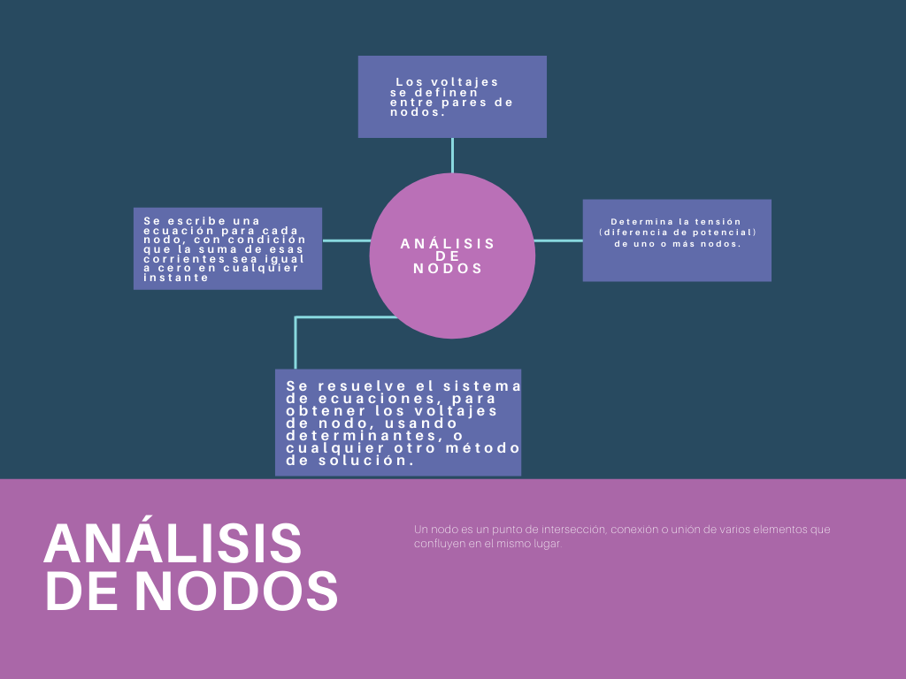
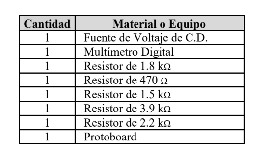
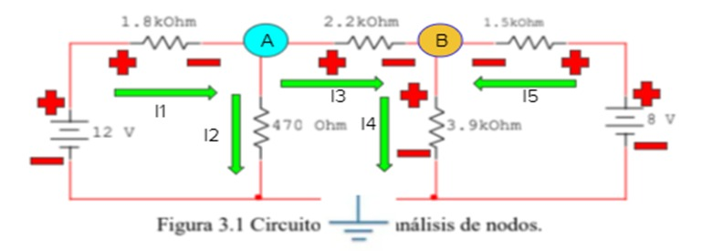
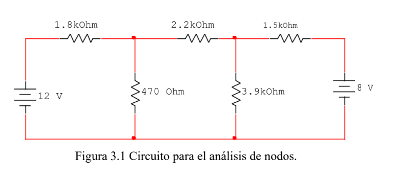
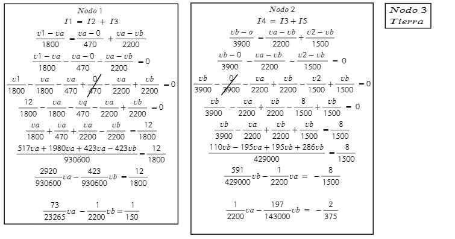
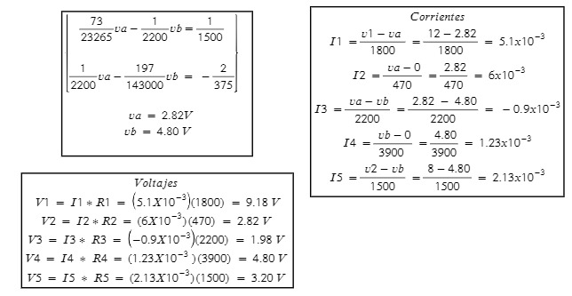
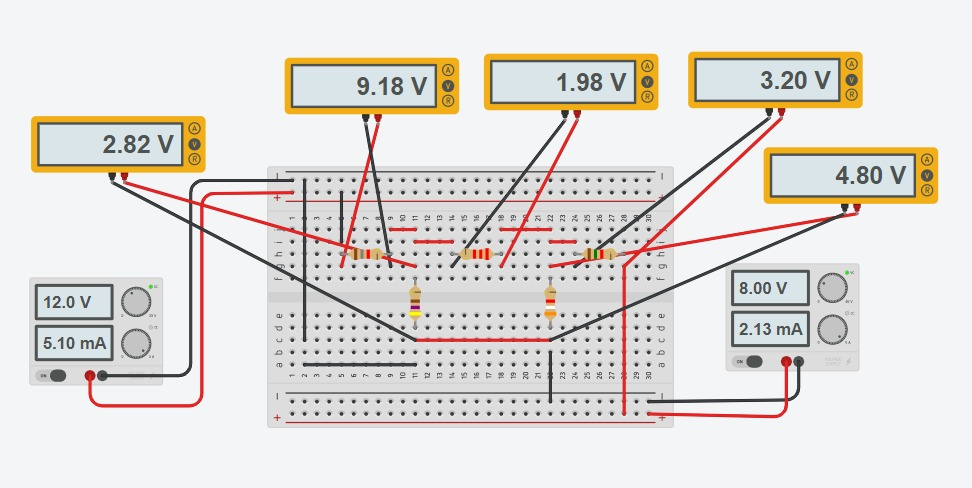

------------
 **Asignatura:**  Fundamentos de Circuitos Eléctricos 
                          
 **Docente:**     Ing. Darwin Alulema            
                    
 **Integrantes:** Mera Erick, Quilumbaquin Lenin, Vallejo Keily
                  
 **Semestre:**    Segundo
 
 **Parcial:**     1
 
 **Laboratorio Nro:**     3
 
------------
## **TEMA:**  Análisis de Nodos
------------

 1. **OBJETIVOS**

    #### Objetivo General:

     - Determinar mediante la técnica de análisis de nodos el voltaje de cada nodo del circuito. 

    #### Objetivos Específicos:

     - Obtener analíticamente el valor del voltaje del circuito mediante el análisis de nodos el cual hace uso de la LCK para expresar corrientes en
función de voltajes.
     - Identificar los puntos en en los cuales dos o más elementos tienen una conexión común conocidos como nodos. 
     - Comprobar los conocimientos adquiridos en clase sobre el analisis de nodos,midiendo corrientes y voltajes en cada uno de los circuitos.
     - Realizar comparaciones entre los datos teóricos usando una de las técnica de análisis de circuitos y los datos prácticos adquiridos en la simulación en tinkerkad.
     
 2. **MARCO TEÓRICO (RESUMEN)**

 3. **EXPLICACIÓN Y RESOLUCIÓN DE EJERCICIOS O PROBLEMAS**

     - MATERIAL
    
    
    
   
    
    
    - PROCEDIMIENTO
  
  
  3.1 Implemente el circuito que se presenta en la figura 3.1.
   
   
   
  
  3.2 Medición de cada una de las corrientes de las malla.
  
  
  
  
  
  
  3.3 Uso del simulador Tinkercad para el circuito de la figura 3.1, obteniendo los valores de caída de voltaje en los nodos.
  
  
  
 
  Tabla 3.4. Resultados obtenidos para el circuito de la figura 3.1.

  | NODO |  RESULTADOS ANALÍTICOS |RESULTADOS SIMULADOS | % de error|
  | ------------ | ------------ |------------ |------------ |
  |  a | 2.82 V | 2.82 V |   0 % |
  |  b | 4.80 V | 4.80 V |   0 % |
  |  3 (tierra) |... | ... |  ... |
  
  
 4. **VIDEO** 
  
  [Análisi de Nodos](  https://youtu.be/ha6tzDD1d9g " Análisis de Nodos ")
 
 
 5. **CONCLUSIONES**
 
       - Concluimos que es posible verificar y comprobar la ley de corriente  de Kirchhoff para circuitos resistivos tanto teoricamente como en la practica. 
       - La técnica análisis de nodos reduce la complejidad del circuito ya que al identificar los nodos resulta sencillo obtener el valor de corriente de los que tienen una fuente de voltaje conectada al nodo de referencia.
       
 
 
 6. **BIBLIOGRAFÍA**
 
    eduMedia. (2021). Leyes de kirchhoff. Obtenido de: https://www.edumedia-sciences.com/es/media/510-leyes-de-kirchhoff

    Ramirez, A. (2019). Leyes de kirchhoff. Obtenido de: https://d1wqtxts1xzle7.cloudfront.net/63362670/Leyes_de_Kirchhoff20200519-84014-3f6yxn-with-cover-page.pdf? 
